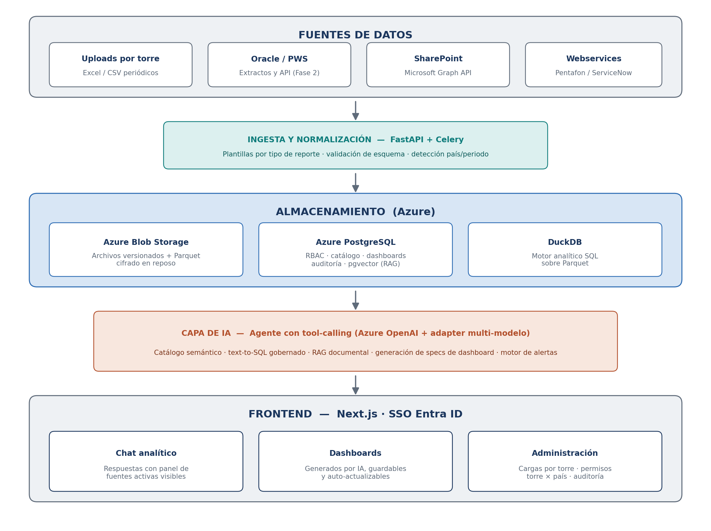

# PowerAI — Documento de Arquitectura y Business Case

**Plataforma de Inteligencia Analítica del SSC Finanzas LATAM**
ManpowerGroup LATAM — Tecnología y Transformación Digital
Versión 0.1 (borrador para revisión) · Junio 2026
Clasificación: uso interno

---

## Contenido

1. [Resumen ejecutivo](#1-resumen-ejecutivo)
2. [Contexto y problema](#2-contexto-y-problema)
3. [Análisis de los casos de uso](#3-análisis-de-los-casos-de-uso)
4. [Visión de la solución](#4-visión-de-la-solución)
5. [Arquitectura técnica](#5-arquitectura-técnica)
6. [Componentes clave del diseño](#6-componentes-clave-del-diseño)
7. [Seguridad y gobernanza](#7-seguridad-y-gobernanza)
8. [Roadmap de implementación](#8-roadmap-de-implementación)
9. [Riesgos y mitigaciones](#9-riesgos-y-mitigaciones)
10. [Estimación preliminar de costos](#10-estimación-preliminar-de-costos-de-operación)
11. [Indicadores de éxito](#11-indicadores-de-éxito)
12. [Próximos pasos](#12-próximos-pasos)

---

## 1. Resumen ejecutivo

El Shared Service Center de Finanzas LATAM atiende a 15 países y concentra la operación de las torres OTC, PTP, RTR, HTR, QCI y CARE. El equipo del SSC identificó más de 150 casos de uso donde la inteligencia artificial puede reducir tiempos de análisis, anticipar riesgos y dar autoservicio de información a los usuarios operativos. Hoy, responder una pregunta tan simple como "cuáles facturas vencen esta semana" o "qué centros de costo están desviados del presupuesto" requiere extraer reportes, cruzarlos manualmente en Excel y esperar a un analista disponible.

PowerAI es la respuesta a esa necesidad: una plataforma interna donde cada torre carga sus reportes periódicos (o se conecta directamente a las fuentes), y cualquier usuario autorizado puede conversar con esa información en lenguaje natural, generar dashboards con IA y guardarlos para consulta recurrente, y recibir alertas automáticas de desviaciones. El usuario siempre ve qué archivos y fuentes sustentan cada respuesta, con su fecha de actualización, lo que garantiza trazabilidad y confianza en los resultados.

La propuesta técnica es Azure-nativa, alineada al ecosistema corporativo de ManpowerGroup (Entra ID, Azure OpenAI, Azure Blob Storage), con un costo de operación contenido y un roadmap incremental que entrega valor desde la primera fase: un MVP de 8 a 10 semanas con la torre OTC, cuyo caso de Aging semanal alcanza por sí solo a más de 200 usuarios potenciales.

## 2. Contexto y problema

El SSC opera con un modelo de torres de servicio que procesan información financiera y operativa proveniente de Oracle, PowerSuite (PWS), SharePoint, webservices de terceros (Pentafon, ServiceNow) y sistemas locales de cada país. La dinámica actual de explotación de información presenta cuatro fricciones estructurales:

- **Dependencia de trabajo manual:** cada pregunta de negocio implica extraer uno o más reportes, normalizarlos y cruzarlos manualmente en Excel, con tiempos de respuesta de horas o días.
- **Cuello de botella analítico:** la capacidad de análisis está concentrada en pocos analistas por torre; los usuarios operativos no tienen autoservicio.
- **Detección reactiva de riesgos:** las desviaciones (cartera vencida, partidas sin conciliar, sobregiros de presupuesto) se detectan cuando alguien las busca, no cuando ocurren.
- **Esfuerzo repetido:** los mismos cruces se rehacen cada semana o cada mes desde cero, sin reutilización ni memoria institucional.

El levantamiento de casos de uso realizado por el propio equipo del SSC (noviembre 2025) documenta esta necesidad de forma exhaustiva y constituye el insumo funcional de este documento.

## 3. Análisis de los casos de uso

Los más de 150 casos levantados se agrupan en tres patrones funcionales, lo cual simplifica radicalmente el diseño: en lugar de construir 150 funcionalidades, PowerAI construye tres motores que los cubren a todos.

### 3.1 Patrones identificados

| Patrón | Descripción | Casos representativos |
|---|---|---|
| Chat analítico | Preguntas en lenguaje natural sobre datos estructurados: rankings, promedios, vencimientos, distribuciones, comparativos. | CU-01 a CU-07 (OTC), AP-01 a AP-06, RTR-01 a RTR-10, IA-01 |
| Reportes y conciliaciones | Generación recurrente de reportes consolidados y cruces entre fuentes: aging, conciliación AR vs GL, bancos vs Oracle, anticipos, project matching. | CU-00, CU-02, CU-03, AP-06 a AP-10, GEN-02 |
| Monitoreo y alertas | Tableros operativos por proceso con vista de estado actual, tendencia histórica y alertas de desviación. | Tríadas OTC/PTP/RTR/CARE/QCI/HTR (-1, -2, -3), IA-T01 a IA-T03 |

### 3.2 Cobertura por torre

| Torre | Casos | Focos principales | Usuarios estimados |
|---|---|---|---|
| OTC | ~15 | Aging, cobranza preventiva, conciliación AR/GL, reservas de incobrabilidad, top clientes | Más de 200 (CU-00) |
| PTP | ~35 | Pagos a proveedores, conciliaciones bancarias y de anticipos, reembolsos, tesorería, tipo de cambio | Más de 100 |
| RTR | ~20 | Estados de gasto, variaciones vs presupuesto, WIP, soporte al cierre contable | 50 a 70 |
| QCI / CARE | ~30 | Calidad de servicio, backlog diario, SLA, productividad del SSC, ServiceNow | 40 a 60 |
| HTR | ~12 | Portal de talento, nómina, facturación del SSC, organigramas | 20 a 30 |
| Generales | ~10 | Generación de dashboards, reportes consolidados, vista financiera integral, alertas | Transversal |

Dos casos requieren capacidades especiales que se tratan como módulos diferenciados: el análisis de grabaciones de llamadas (QCI-01) requiere transcripción de voz, y la lectura de contratos de proveedores (AP-10) requiere extracción de información de documentos no estructurados.

## 4. Visión de la solución

PowerAI es un espacio de trabajo analítico con IA donde la información del SSC vive organizada por torre y siempre visible para quien la consulta. Tres principios rectores definen el producto:

- **Transparencia de fuentes:** el usuario ve en todo momento qué archivos y fuentes alimentan cada respuesta, con fecha de carga y responsable. Ninguna respuesta es una caja negra.
- **Datos gobernados:** la IA no consulta datos crudos: consulta un catálogo semántico gobernado con definiciones de negocio validadas por cada torre. Esto reduce drásticamente el riesgo de respuestas incorrectas.
- **Adopción incremental:** cada fase entrega valor utilizable por sí misma. No se requiere completar toda la plataforma para empezar a operar.

El flujo operativo es deliberadamente simple: un usuario con rol de carga en cada torre sube los reportes periódicos extraídos de sus sistemas (o, en fases posteriores, el sistema los obtiene solo mediante conectores). PowerAI valida, normaliza y almacena la información. A partir de ahí, cualquier usuario autorizado de esa torre pregunta en lenguaje natural, genera y guarda dashboards, y recibe alertas en Microsoft Teams cuando algo se desvía.

## 5. Arquitectura técnica

### 5.1 Vista general

*Figura 1. Arquitectura por capas de PowerAI.*

### 5.2 Stack tecnológico

| Capa | Tecnología | Justificación |
|---|---|---|
| Frontend | Next.js (React) + Tailwind | Estándar de industria, SSR para rendimiento, ecosistema maduro de componentes empresariales. |
| Backend / API | Python + FastAPI | Ecosistema de datos e IA más completo (pandas, conectores Oracle, SDKs de LLM). Alta productividad. |
| Procesos asíncronos | Celery + Azure Cache for Redis | Ingesta de archivos, jobs programados de alertas y tareas de larga duración fuera del request. |
| Base transaccional | Azure Database for PostgreSQL | Metadata, usuarios, permisos, catálogo de archivos, dashboards guardados, auditoría. pgvector para búsqueda semántica documental. |
| Motor analítico | DuckDB sobre Parquet | Consultas SQL columnares de alto rendimiento sin costo de warehouse dedicado. Dimensionado ideal para los volúmenes del SSC. |
| Object storage | Azure Blob Storage | Archivos originales versionados y datasets Parquet. Cifrado en reposo nativo. |
| Modelo de IA | Azure OpenAI (principal) | Residencia de datos en Azure, contrato corporativo existente. Capa adapter que permite incorporar otros modelos según el caso. |
| Identidad | Microsoft Entra ID (SSO) | Integración con el directorio corporativo. Sin contraseñas nuevas para el usuario. |
| Despliegue | Azure Container Apps | Contenedores administrados, escalado automático, menor carga operativa que AKS para este tamaño de solución. |
| Voz (módulo QCI) | Azure AI Speech | Transcripción de grabaciones de llamadas para análisis de calidad de atención. |

### 5.3 Flujo de una consulta

Cuando un usuario pregunta, por ejemplo, "cuáles son los top 5 clientes con mayor deuda vencida", el agente de IA identifica la intención, consulta el catálogo semántico para ubicar el dataset correcto (Aging de la torre OTC, filtrado por los países que el usuario tiene permitidos), genera la consulta SQL, la ejecuta en DuckDB sobre los Parquet más recientes, y redacta la respuesta citando las fuentes: archivo, fecha de carga y responsable. La consulta SQL ejecutada queda registrada en la bitácora de auditoría junto con la pregunta y la respuesta.

## 6. Componentes clave del diseño

### 6.1 Plantillas de reporte

Los mismos reportes recurrentes (Aging, Trial Balance, Payment Register, WIP LATAM, Enquirys, entre otros) se cargan semana tras semana. PowerAI los modela como entidades de primera clase: cada tipo de reporte tiene un esquema esperado, un mapeo de columnas y reglas de validación. Al cargar un archivo, el sistema verifica la estructura, detecta país y periodo, y rechaza archivos malformados con un mensaje claro para el usuario. Esta disciplina en la entrada es la condición necesaria para la calidad de las respuestas.

**Definición por descubrimiento (ver ADR-0006):** las plantillas no se programan, se descubren. La primera carga de un tipo nuevo enseña su estructura: el sistema lee los encabezados, quien conoce los datos (admin o uploader de la torre) confirma el mapeo (nombre de negocio + tipo) y las llaves de país/periodo, y nace la plantilla junto con una **vista 1:1 automática** que el admin nombra y describe — descripciones que el experto (ADR-0005) lee para decidir qué consultar. Así se cierra la cadena plantilla→archivo→vista→fuente del experto sin SQL manual. Las cargas siguientes comparan contra la plantilla: si calzan, se previsualizan y guardan; si no, se **mapean** (se acomoda el archivo al molde, sin redefinirlo). Cambiar el molde es un acto explícito de admin, con aviso de impacto a las cargas existentes — nunca un efecto colateral de cargar un archivo.

### 6.2 Catálogo semántico y text-to-SQL gobernado

El agente de IA nunca consulta tablas crudas. Consulta vistas curadas con nombres y definiciones de negocio (facturas abiertas, pagos AP, WIP LATAM) documentadas y validadas por cada torre. El modelo genera SQL únicamente contra ese catálogo, con seguridad a nivel de fila por país y torre aplicada por el motor, no por el modelo. Este diseño es lo que distingue una demostración de un producto confiable para finanzas.

### 6.3 Dashboards generados por IA y guardables

Cuando el usuario pide un dashboard, el modelo no genera código: genera una especificación declarativa (definición de visuales más las consultas que los alimentan) que el frontend renderiza. Guardar un dashboard significa guardar esa especificación. Al reabrirlo, las consultas se re-ejecutan contra los datos más recientes, de modo que el dashboard se actualiza automáticamente con cada nueva carga del reporte. Para los usuarios que requieran Power BI, los datasets quedan disponibles como fuente para conectar Power BI directamente sobre ellos.

### 6.4 Conciliaciones híbridas con supervisión humana

En las conciliaciones (bancos vs Oracle, anticipos, project matching), el cruce de partidas lo realiza un motor determinístico de reglas y coincidencia aproximada, garantizando resultados reproducibles y auditables. El rol de la IA es explicar las partidas no conciliadas, sugerir causas probables y redactar el reporte. Las conciliaciones nunca se dan por cerradas sin validación humana; la plataforma deja constancia de quién validó y cuándo.

### 6.5 Motor de alertas hacia Microsoft Teams

Trabajos programados evalúan reglas de desviación sobre cada nueva carga de datos (cartera vencida sobre umbral, centros de costo desviados, SLA en riesgo, conciliaciones pendientes). Cuando una regla dispara, la IA redacta un resumen ejecutivo de la desviación y lo publica en el canal de Teams de la torre correspondiente. El usuario no tiene que entrar a preguntar: la plataforma le avisa.

### 6.6 Frescura de datos visible

Junto al panel de fuentes, cada dataset muestra su antigüedad (por ejemplo: Aging México actualizado hace 2 días; Aging Colombia hace 15 días, con indicador de advertencia). En una operación de 15 países, saber con qué datos se está respondiendo es tan importante como la respuesta misma, y la visibilidad empuja culturalmente a mantener las cargas al día.

### 6.7 Calidad continua: banco de preguntas doradas

A partir del propio levantamiento del SSC se construye un banco de 30 a 40 preguntas con respuesta correcta verificada manualmente. Cada cambio de modelo, de prompt o de catálogo se valida automáticamente contra ese banco antes de liberarse. Es la red de seguridad que protege la confianza de los usuarios en la herramienta.

### 6.8 Experto configurable por torre, gobernado por evals

El comportamiento del agente no está hardcodeado: cada torre tiene un "Experto" con identidad, tono, formato y fuentes permitidas configurables por su administrador (ver ADR-0005). El poder de configuración lleva barandales: lo configurable (identidad/formato/fuentes) se separa de lo estructural (RLS, text-to-SQL gobernado, honestidad ante métricas no soportadas), que vive en el motor y no se edita desde ningún formulario; y ninguna configuración se activa hasta validarse contra el banco de preguntas doradas de su torre (≥95%). La activa anterior se archiva (rollback posible).

## 7. Seguridad y gobernanza

| Dimensión | Diseño |
|---|---|
| Identidad y acceso | SSO con Microsoft Entra ID. Sin cuentas ni contraseñas nuevas. |
| Autorización | RBAC en dos dimensiones: torre × país. Roles diferenciados de carga (uploader), consulta y administración por torre. |
| Cifrado | Cifrado en reposo en Azure Blob y PostgreSQL; TLS en tránsito en todos los componentes. |
| Residencia de datos | Toda la información y el procesamiento de IA permanecen dentro del tenant Azure corporativo (Azure OpenAI no entrena con los datos). |
| Auditoría | Bitácora completa: cada pregunta, respuesta, consulta SQL ejecutada y archivos fuente utilizados, por usuario y fecha. Carga y versión de cada archivo con responsable. |
| Ciclo de vida de datos | Versionado de archivos, política de retención configurable por tipo de reporte, y baja lógica con rastro de auditoría. |
| IA responsable | El modelo no toma decisiones financieras: informa, explica y alerta. Conciliaciones y cierres siempre con validación humana registrada. |

## 8. Roadmap de implementación

El plan privilegia entregar valor temprano con una torre y expandir sobre lo probado. OTC es la torre inicial por la combinación de alto impacto, fuente principal única (Aging) y la mayor base de usuarios potenciales del levantamiento.

| Fase | Alcance | Entregables | Duración |
|---|---|---|---|
| Fase 1 — MVP OTC | Torre OTC | Carga de reportes con plantillas, chat analítico con panel de fuentes, RBAC torre × país, auditoría. Casos CU-00 a CU-07. | 8 a 10 semanas |
| Fase 2 — Dashboards y alertas | OTC + PTP | Dashboards generados por IA y guardables, motor de alertas a Teams, conciliaciones híbridas (AP-06 a AP-09). | 6 a 8 semanas |
| Fase 3 — Expansión de torres | RTR, QCI, CARE, HTR | Onboarding de plantillas y catálogo semántico por torre, vista financiera integral (IA-T01), explicación de variaciones (IA-T03). | 8 a 10 semanas |
| Fase 4 — Conectores y voz | Transversal | Conectores directos a Oracle y SharePoint (Graph API), webservices, y módulo de transcripción para QCI-01. Lectura de contratos (AP-10). | 8 a 12 semanas |

## 9. Riesgos y mitigaciones

| Riesgo | Nivel | Mitigación |
|---|---|---|
| Respuestas incorrectas de la IA que erosionen la confianza | Alto | Catálogo semántico gobernado, text-to-SQL sobre vistas curadas, banco de preguntas doradas en cada release y citación obligatoria de fuentes. |
| Calidad inconsistente de los archivos cargados | Alto | Plantillas con validación de esquema en la carga; rechazo con mensaje claro; indicador de frescura por dataset. |
| Datos desactualizados que generen decisiones erróneas | Medio | Frescura visible en cada respuesta; alertas de cargas vencidas a los responsables de cada torre. |
| Costos de consumo de IA fuera de control | Medio | Caché de respuestas, prompt caching del catálogo, registro de tokens por usuario y torre, y tablero de consumo mensual. |
| Baja adopción de los usuarios | Medio | MVP con la torre de mayor demanda, embajadores por torre, casos del propio levantamiento como guía de onboarding. |
| Dependencia de un solo proveedor de modelo | Bajo | Capa adapter multi-modelo desde el diseño; el cambio de modelo no toca la lógica de negocio. |

## 10. Estimación preliminar de costos de operación

Cifras de orden de magnitud para dimensionamiento presupuestal, a refinar con el piloto de la Fase 1. No incluyen el costo del equipo de desarrollo.

| Concepto | Rango mensual (USD) | Notas |
|---|---|---|
| Azure Container Apps + Redis | 150 – 400 | Escala con uso; mínimo en horario no laboral. |
| Azure Database for PostgreSQL | 100 – 300 | Instancia flexible, alta disponibilidad opcional en producción. |
| Azure Blob Storage | 20 – 80 | Volúmenes de reportes del SSC; tier cool para histórico. |
| Azure OpenAI (consumo de tokens) | 300 – 1,500 | Depende de la adopción; el caché y el prompt caching lo contienen. Medible por torre desde el día uno. |
| Azure AI Speech (módulo QCI) | 100 – 400 | Solo a partir de la Fase 4, proporcional a horas de audio. |
| **Total estimado** | **670 – 2,680** | Orden de magnitud; el MVP de Fase 1 opera en la banda baja. |

## 11. Indicadores de éxito

- **Velocidad:** tiempo de respuesta a preguntas operativas: de horas/días a menos de un minuto en los casos cubiertos por el chat analítico.
- **Adopción:** usuarios activos semanales por torre y número de preguntas respondidas; meta de adopción del 60% de los usuarios objetivo de cada torre a los 3 meses de su onboarding.
- **Confiabilidad:** tasa de acierto del banco de preguntas doradas igual o superior al 95% en cada release.
- **Disciplina de datos:** porcentaje de datasets con carga al día (frescura) por torre; meta superior al 90%.
- **Eficiencia:** horas-analista liberadas por mes en reportes y cruces recurrentes, medidas con el baseline del levantamiento del SSC.

## 12. Próximos pasos

1. Validar este documento con el liderazgo del SSC y priorizar formalmente los casos de la Fase 1 con la torre OTC.
2. Presentar la arquitectura a Global Technology para alineación con los estándares corporativos de Azure y de IA.
3. Conformar el equipo de implementación (IT LATAM) y aprovisionar el entorno de desarrollo en Azure.
4. Definir con OTC las plantillas de los tres reportes fuente del Aging (AR abiertas, pagos unapplied, revenue reconciliation) como primer catálogo semántico.
5. Construir el banco inicial de preguntas doradas a partir del levantamiento de casos de uso del SSC.
